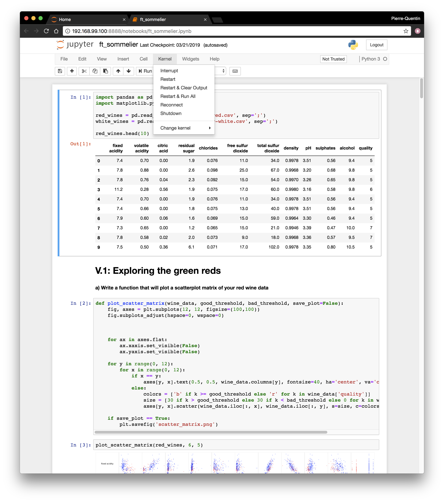

# ft_sommelier
Basic regression project without any Machine Learning framework. Just Pandas,
because pandas are cute.

# Usage & testing
This project uses Jupyter Notebook. It will be easier to run using a specific
Docker environment. Follow the instructions provided in the Dockerfile to setup
the machine and the container.

Once setup is done, run the script to launch the server:
```shell
sh ./launch.sh
```

Open your browser and go to `<docker-machine-ip>:8888`. Insert the token
provided in the command line.


Click on the notebook to launch it in a new tab.


You can press `Kernel -> Restart & Run All` to rerun the Notebook from start.


Follow the notebook and have fun!

